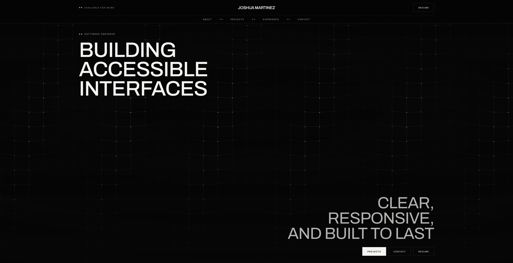
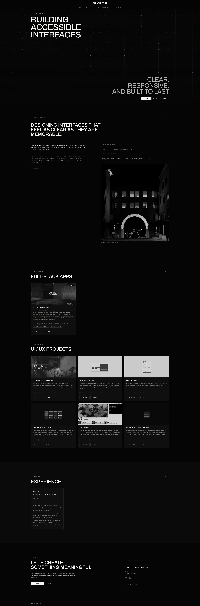
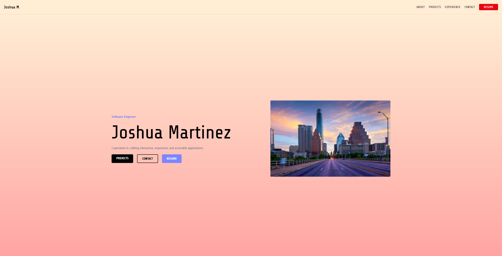
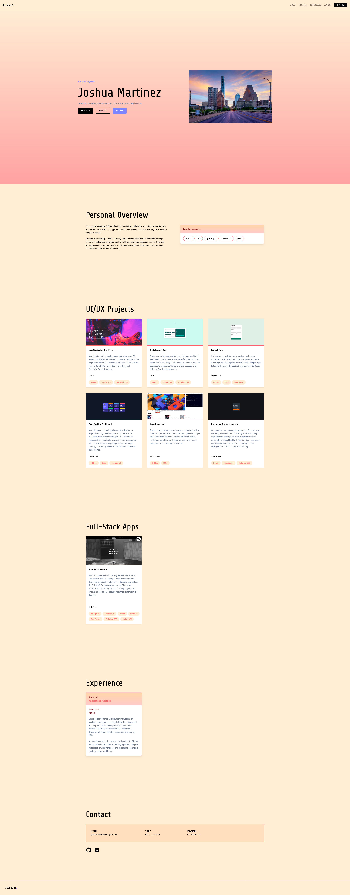

# Portfolio

A personal portfolio for a frontend-leaning software engineer. Read the work, scan the timeline, open the resume, get in touch.

**Live:** [joshuam-portfolio.vercel.app](https://joshuam-portfolio.vercel.app/)

See the full page

See the previous design

The first version. Same structure and the same navigation mechanics, a very different surface.

**Stack:** React 19 · TypeScript · Tailwind v4 · React Aria Components · Vite 8 · Vercel

A single-page site, deliberately. Everything is one route with anchor navigation, so there is no router, no data fetching, and no state beyond what a dialog needs. That makes it a project about presentation rather than plumbing: the interesting decisions are in the design system, the layout, and the accessibility, because there is nothing else for them to hide behind.

---

## Design decisions

**Content lives in one file, sections read from it.** `src/data.ts` exports the projects, the timeline, the experience, the competencies, and the contact details. Every section maps over that data rather than hard-coding markup, so adding a project is one object rather than a copied block. It also means a fact appears once: the resume modal and the experience section render the same role from the same entry, which is the fix for a bug where the two disagreed about a job title and a date range for several commits.

**Design tokens in the stylesheet, not the markup.** `src/App.css` defines the palette as ink for surfaces, bone for type, one accent for live states, and hairline rules for structure. Component classes are built from those tokens and live in `@layer components`, which matters more than it sounds: without the layer, a plain class and a Tailwind utility have identical specificity, so whichever loads last wins. Putting them in the layer means utilities always win, which is what you want when you reach for one.

**Sizing with `clamp()` rather than breakpoints.** The shell, the section padding, the display type, and the experience card all interpolate between a floor and a ceiling. Fewer breakpoints means fewer places for the layout to jump, and a ceiling is what stops a text column from stretching past a readable measure on a wide screen.

**React Aria for the one interactive component.** The resume modal is the only real widget on the site. Focus trapping, escape handling, scroll locking, and the labelling relationship between the dialog and its heading are all things I would have got subtly wrong by hand.

**Motion that yields.** Four animations: a grid behind the hero with a wave crossing it, a highlight travelling across the headlines, the timeline drawing itself in as it scrolls into view, and a light orbiting the "new" badge. The grid pauses when the hero scrolls out of view and paints a single static frame under `prefers-reduced-motion`; the timeline's resting state *is* its finished state, so anything that never arms simply sees it drawn; the rest are neutralised by a global reduced-motion block. Nothing animates that a visitor cannot opt out of.

**One measurement, published once.** The header measures itself and publishes its height as `--header-h`, which `scroll-padding-top` consumes. Hard-coding it meant the value drifted the moment the header changed, and the drift showed as a strip of background between the header's bottom border and the border of whichever section an anchor landed on. The hero also sizes itself against it, so it fills exactly what the header leaves of the viewport.

**Contrast checked against the surface, not the page.** Type sits on three different grounds here. A token verified against the darkest one is not automatically safe on a lighter card, which is exactly how a label ended up at 4.44:1 on the experience surface while passing everywhere else.

---

## Challenges faced

**Images that would not fit their frames.** The project screenshots are all 2560x1230, but the card was `aspect-16/10`, so `object-cover` was quietly trimming about 11% off each side. Setting the box to the screenshots' own ratio meant `object-cover` could fill it and crop nothing. The overview portrait had the opposite problem: it is portrait, and it sat in a fixed-height box that showed 27% of it.

**A phantom gap that moved between breakpoints.** An offset heading was positioned with an empty spacer `div` in a grid. Below the breakpoint the grid collapsed to one column, and the spacer became a zero-height row that still paid the row gap, pushing the heading down by an extra 48px. Positioning with `col-start` instead of an empty element removed both the gap and the element.

**A highlight that ran backwards, then vanished.** The sweep across the hero headlines went wrong twice. First it travelled the wrong way: when `background-size` is larger than the element, the offset resolves to `(container - image) * position`, and that term is negative, so a percentage moves the image opposite to the number. Counting down instead of up fixed it. Then, once the headline went back to solid bone, it disappeared — bone is already 244 of 255, so a white band can only add about 4% luminance. It reads now because the band carries a slight darkening either side of its core, and it is the dip against the peak that the eye registers as a highlight rather than the peak itself.

**Viewport units that measure the wrong viewport.** On mobile, `vh` resolves against the viewport with the browser's URL bar collapsed, so a hero sized in `vh` runs underneath that bar and clips whatever sits at its bottom edge — here, the three calls to action. `svh` is the small viewport, measured with the chrome expanded, and fixes it. `svh` rather than `dvh` deliberately: `dvh` tracks the bar as it collapses during a scroll, which would resize the hero underneath the reader. The `vh` fallback also needed writing as `@supports` rather than two declarations in one rule, because the minifier reads the second as redundant and drops the first — leaving nothing at all for browsers without the newer units.

**A scrollbar that appeared for 300ms.** Opening the resume panel flashed a scrollbar down its right edge. Its entrance animated each block from 12px below its final position, and the last one pushed past the bottom of the dialog, which is a scroll container — so its scrollable area grew and then shrank again. Animating from *above* instead solved it: overflow past the block-start edge of a scroll container is unreachable, so it never produces a scrollbar.

**Filling a column without knowing its height.** The timeline sits beside a portrait whose height depends on the viewport. Rather than guessing, it uses `justify-between` inside a growing flex column, so it distributes across whatever height the image sets. When the entries later grew long enough to consume the column, the gap had to become a floor rather than the spacing, or they touched.

---

## What I learned, and what I want to improve

**A design system is mostly decisions about where things live.** Most of the work was not choosing colours. It was deciding that colours belong in tokens, that structure belongs in hairlines, that a repeated motif belongs in a component, and then not breaking those rules when something was faster to do inline.

**Duplication is where facts drift apart.** The same role was written into two places and they disagreed within a fortnight. Anything stated twice will eventually be stated differently.

**Accessibility is measurable, so measure it.** Contrast is arithmetic, not taste. Every text style on the page was checked against the surface it actually renders on, and two of them failed on a surface they had never been checked against.

**Animation is cheap to add and expensive to get right.** Four small animations took more iterations than the entire layout, and almost none of the difficulty was in the animating. It was in what the motion disturbed around it: a transform that grew a scroll container, an entrance that had to stay in step with a line drawing itself, a highlight with no luminance left to work with.

What I'd do differently next time:

- **Decide the image pipeline before collecting images.** Three project screenshots are still PNGs totalling roughly 4MB, which is most of the deployed weight. Converting one image to WebP took it from 1.4MB to 45KB. Deciding on a format and a target size before adding the first screenshot would have avoided a retrofit.

- **Write the copy before designing around it.** Several layout problems were really copy problems: a heading that squished around a hyphen, a timeline entry that outgrew its column, a paragraph that ran 112 characters per line. Fixing type after the words change is a different job than choosing type to fit them.

- **Check contrast at the token level, against every surface.** The tokens were verified once, against the page background, and then surfaces were added underneath them.

- **No tests.** There is no automated check that the anchors resolve, that every project renders, or that the modal opens. On a site this size that is a defensible trade, but "defensible" is doing some work in that sentence.

---

## What AI tooling helped with

**The first version was built without any.** It was designed from scratch, working from other software engineers' portfolios as reference for what the genre does well: how much work to show before asking for attention, where the resume belongs, how long an about section should run. Every design decision, every bug fix, and all of the responsive behaviour in that version was mine.

A few things about how it was written are worth naming, because they are what the current version inherited:

- **Fluid sizing rather than breakpoints.** Widths and spacing were set with `clamp()` in plain CSS classes: `.hero-container`, `.featured-project`, `.featured-section`, `.modal-pop-up`. Each interpolated between a floor and a ceiling instead of stepping at a media query, so the layout moved continuously with the viewport rather than jumping. The current design system is built the same way, and the capped experience card is a direct descendant of `.featured-project { width: clamp(20rem, 20vw, 25.5rem) }`.
- **A shared measure applied by grouping selectors.** One rule gave every section container the same width, so the page held a single column edge without repeating the value in five places.
- **Tailwind v4's `@theme` block used for real tokens.** A custom font family, a named keyframe animation for the modal, and a custom breakpoint at `70.875rem` — a specific enough number that it was clearly measured against the actual content rather than picked off a scale.
- **Data separated from markup.** Project details lived in `data.ts` and were rendered with a `.map()`, which the commit history shows was a deliberate refactor away from hand-writing the TSX for each card.
- **Accessible dialog semantics from the start.** The resume modal used React Aria Components rather than a hand-rolled overlay, with `::backdrop` styled in CSS.
- **Anchor navigation with no JavaScript.** Section IDs plus `scroll-smooth` on `<html>`, which is still how the navigation works today.

**The one exception was the project card hover.** The lift on hover — `transition-all duration-1000 ease-out hover:translate-y-[-3%] hover:shadow-xl` — was the single place AI tooling contributed to that version: a slow ease-out rise with the shadow deepening underneath it, plus the matching tint on the core competency pills. That behaviour survived the overhaul in spirit, retimed and restyled to suit a darker surface.

**Then the visual overhaul, with [Claude Code](https://claude.com/claude-code).** On a branch, merged by pull request. The brief was a design reference and one constraint: keep the mechanics. The sticky header, the anchor navigation, the smooth scrolling, and the resume modal all came through unchanged, because they worked and the problem was the surface. What changed underneath was the design language, from ad-hoc utility classes to a documented token system with a type scale, hairline structure, and reusable component classes. The section order, the navigation model, and the content hierarchy were carried over on purpose: those UX decisions were sound, and re-deciding them would have made the diff impossible to review.

It also caught things I had not gone looking for. A project image path was relative, so it broke anywhere but the root. The mobile navigation overflowed the viewport. `scroll-padding-top` did not clear the sticky header, so anchored sections landed underneath it. The resume modal duplicated its own markup in the header, and its experience block had drifted out of sync with the experience section. A colour token failed WCAG AA on a card surface. Every rendered text node on the page now clears AA, which was not true before.

The tool did the sweep. The direction, and roughly forty rounds of "that is not quite right, try this instead," stayed mine, which is most of what the commit history after the merge actually is.

---

Built by [Joshua M.](https://github.com/JoshuaM04)
